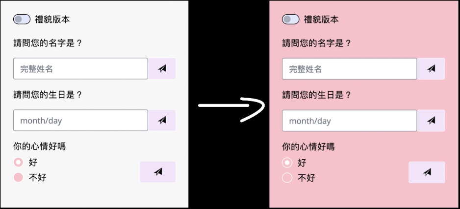
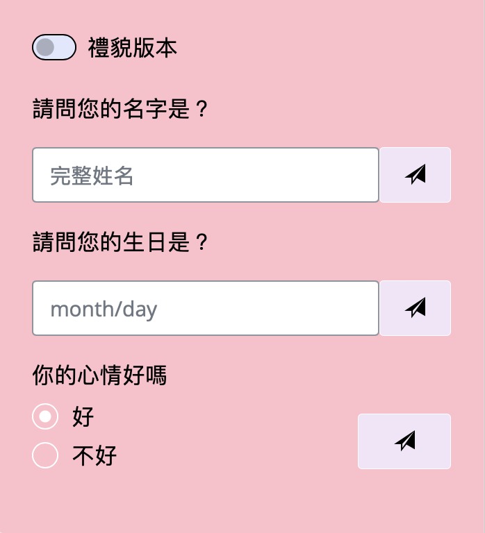
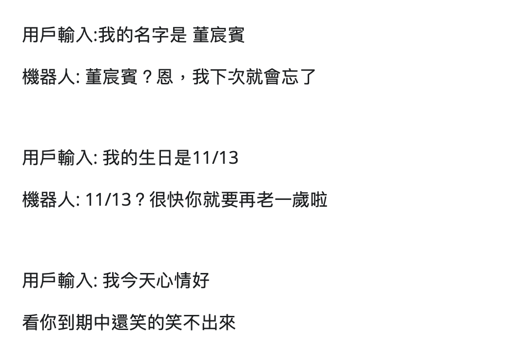

```{r setup, include=FALSE}
knitr::opts_chunk$set(echo = TRUE)
library('xaringan')
library('reticulate')
```

class:inverse,center
## 程式設計概論作品展示

功能：依照使用者提供的訊息，作出相應的回答

概念：練習基礎的python

機器人網站：

```{r, echo=FALSE, out.width="30%"}

```

---
class:inverse,center

## 製作方法

使用shiny，代替難用的scanner

---

class:inverse2,center
layout: true
##shiny與scanner比較
---

.pull-left[
### Scanner

1.輸入：
```{}
name = input("你叫什麼名字?")
```

2.輸出：
```{}
print("機器人: ",name,
"這個名字真好聽，很高興今天能跟你聊天！")
```
]
--
.pull-right[
### Shiny

1.輸入：
```{}
ui.input_text("u_in1","你叫什麼名字")
```

2.輸出：
```{}
return f"機器人: {input.u_in1()}？
這個名字真好聽，很高興今天能跟你聊天！"
```

]
---

.pull-left[
### Scanner

3.結果

```{r, echo=FALSE,out.width="100%"}

```
]
--
.pull-right[
### Shiny

3.結果

```{r, echo=FALSE, out.width="70%"}

```

]

---

.pull-left[
.text-alignl[
### Scanner

1.輕鬆上手

2.可以在terminal或console執行

3.不美觀]
]

.pull-right[
.text-alignl[
### Shiny

1. 結構較為複雜

1. 需要額外import module

2. 是網站屬性，可以加入css美化

3. 可以成為webapp
]
]
---
class:inverse2,center
layout: false

## 等等，你說**css**?

--

### 主題不是Python機器人嗎？

--

### 你是不是寫成java script機器人了？

--

### 這個嘛...

```{r, echo=FALSE, out.width="50%"}

```

---
class:inverse2,center

## 總體架構

.text-alignl[

### 1.ui: 就是我們所說的使用者介面

.lri[
包括頂部css，導覽介面、使用者側面輸入欄與結果欄
]
]

--

.text-alignl[

### 2.server: 運作端

.lri[
在這裡運作程式，比如print，if...
]

]

--

## 是不是很簡單！

---
class: inverse2,center
layout: true

## ui 介紹

.pull-left2[
### **頂部css**


### 導覽介面


### 使用者輸入欄


### 結果欄

]

.pull-right2[
.text-alignl[
不需要在加入額外的css file，只要在頂端加入
```{}
ui.tags.style(
"""
.form-control {width: 250px;height: 40px}
.custom-row {display: flex;}    
*.sidebar-content {background-color: pink;} 
""")
```
]
]

---

--

.pull-right2[
```{r, echo=FALSE, out.width="100%"}

```
]

---
.pull-right2[
所以我說我沒有寫任何css吧！

```{r, echo=FALSE, out.width="40%"}

```
]

---
class: inverse2,center
layout: true

## ui 介紹

.pull-left2[
### 頂部css


### **導覽介面**


### 使用者輸入欄


### 結果欄

]


---

.pull-right2[
.text-alignl[
另外，我引入Bootstap5的導覽格式

```{}
page_header=ui.tags.nav(
  {"class": "navbar navbar-inverse"}, 
  ui.tags.div(
  {"class": "container-fluid"}, 
   ui.tags.div(
      {"class": "navbar-brand"}, 
      HTML("<a class='navbar-brand'>聊天機器人</a>")),
   ui.tags.ul(
     {"class": "nav navbar-nav"},
     HTML("<li><a class='active' href='https://github.com/blingblingdong/python_in_shiny'>對話機器人</a></li>"),
     HTML("<li><a class='active' href='#'><span class='glyphicon glyphicon-info-sign'></span> 查看原始碼</a></li>"),
     HTML("<li><a class='active' href='https://rpubs.com/lsysocute/shiny-robot'><span class='glyphicon glyphicon-thumbs-up'></span>介紹簡報</a></li>")
   )
        )
   )
```
]
]

--
.pull-right2[
.text-alignl[
是不是有點複雜呢？
]]
---

.pull-right2[
.text-alignl[
## htmltool 

首先載入htmltools
```{python}
from htmltools import HTML, div
```

接著，使用HTML()將html程式寫入
```{python}
a = HTML("<a class='navbar-brand'>聊天機器人</a>")
```

python就可以將字串a判讀成html函式
```{python}
a
```
]]

---
class: inverse2,center
layout: false

## ui 介紹

.pull-left2[
### 頂部css


### 導覽介面


### **使用者輸入欄**


### 結果欄

]

.pull-right2[

這邊簡單講解一下4個輸入

1.切換鈕
2.文字輸入
3.發送鈕
4.選擇鈕

```{r, echo=FALSE, out.width="50%"}

```

]
---
class: center,inverse

## ui 介紹

.pull-left2[
### 頂部css


### 導覽介面


### 使用者輸入欄


### **結果欄**

]

.pull-right2[
.text-alignl[

這邊簡單講解一下2個輸出

1.使用者輸出 (u_out1)

2.電腦輸出   (c_out2)


```{}
ui.panel_main(
ui.output_text("u_out1"),
ui.output_text("c_out1"))
```

]]

--

.pull-right2[
.text-alignl[
```{r, echo=FALSE, out.width="50%"}

```
]]


---
class: center, bottom, inverse
layout: false

# More info

--

本投影片是使用R package [**xaringan**](https://github.com/yihui/xaringan).

--

查克拉來自[**remark.js**](https://remarkjs.com), [**knitr**](https://yihui.org/knitr), and [**R Markdown**](https://rmarkdown.rstudio.com).

--

點擊進入[**Web app**](https://lsysocute.shinyapps.io/shinyrobot/)，[**Github**](https://github.com/blingblingdong/python_in_shiny)，[**本簡報**](https://rpubs.com/lsysocute/shiny-robot)

--

### 謝謝聆聽

--
```{r, echo=FALSE, out.width="30%"}
knitr::include_graphics("libs/sheep.gif")
```
--

THE END
